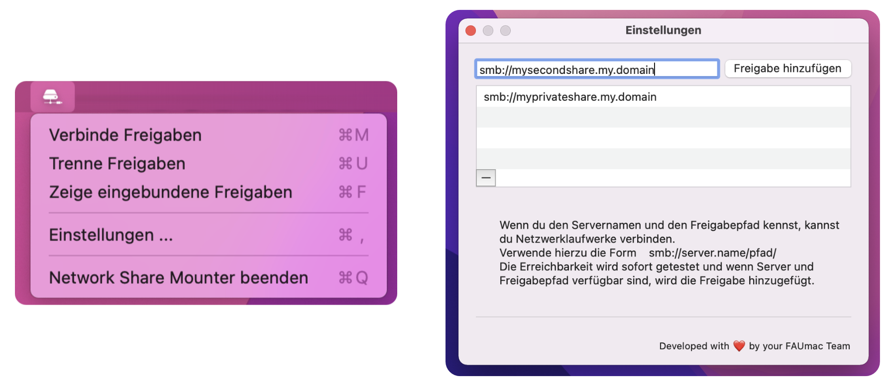

#  Network Share Mounter 

In a university or company environment, there is usually a requirement to mount specific SMB shares depending on departments or locations - often multiple shares depending on the current location. The macOS built-in method for mounting shares is not very user-friendly and does not provide an ideal solution for enterprise environments. Consequently, solutions using scripts or other tools are often rigid and inflexible for users. To create a perfect solution for administrators _and_ end users, we have developed the Network Share Mounter.

The concept behind Network Share Mounter is to have a single application handle the mounting of a list of network shares. Ideally, the list of shares is distributed as a configuration profile using an MDM solution based on workgroups, departments, project groups, etc. If a user requires additional shares, beyond the managed ones, they can personally add shares through the menu bar.    
Shares are mounted in the background based on network accessibility without any user intervention. Even in the event of a mount failure, such as an unreachable share, no graphical user interface will appear. For this reason, a Kerberos environment is recommended to avoid the need for authentication during a mount. Alternatively, user credentials can be stored in the user's keychain by manually mounting a share once. Therefore, please be aware that no notification will be displayed in case the credentials are invalid or unavailable!  

**Configuration**  
Network shares are stored in a NSUserdefaults domain among other configurable aspects of the app. The easiest way to configure the app is to create a configuration profile and distribute the profile via MDM. Alternatively, the configuration can also be done manually via the command line (i.g. defaults).   
As a tip: to avoid creating a profile for every user, use `%USERNAME%` which will be replaced with the login name of the current user. See [configuration preferences](#configuration-preferences) for all available values. 

**SMBHome**  
If the current user has the attribute `SMBHome` defined via LDAP or Active Directory, the user home will be mounted automatically. This is usually the case when the Mac is bound to an Active Directory and the LDAP attribute `HomeDirectory` is set. If necessery, you can set the attribute for a local user manuelly:  
 `dscl . create /Users/<yourusername> SMBHome \home.your.domain<yourusername>`.

### ⚙️ Configuration preferences
For an easier configuration of all the preference keys without creating or modifying a custom Configuration Profile in XML format we provieded a JSON Manifest Schema for Jamf Pro. [Download the manifest file](https://gitlab.rrze.fau.de/faumac/networkShareMounter/-/blob/master/jamf-manifests/Network%20Share%20Mounter.json). We also added a manifest to the [iMazing Profile Edior](https://imazing.com/profile-editor). 

 The defaults domain for v2 is `de.fau.rrze.NetworkShareMounter`. Available payload values: 

| Key                 | Type  | Description            | Default value | Aviable with version | Required? | Example |
| :------------------ | :---- | :---------------------|:-------------------------------------- | --------------------------------- | ------- | ---- |
| `networkShares`     | Array | Array with all (SMB) network shares.     Note: `%USERNAME%` will be replaced with the login name of the current user. | - | all | - |`smb://filer.your.domain/share` `smb://homefiler.your.domain/%USERNAME%`|
| `customNetworkShares` | Array | Array with all user configured (SMB) network shares.  It's not recommend to configure this array via MDM. | - | all | optional |`smb://myhomefiler.my.domain/share`|
| `autostart` | Boolean | If true, the app will be launched upon user login. | false | >=2.0.0 | optional ||
| `canQuit` | Boolean | If true, the user can exit the app in the menu bar. | true | >=2.0.0 | optional ||
| `canChangeAutostart` | Boolean | If set to false, the user can not change the autostart option. | true | >=2.0.0 | optional ||
| `unmountOnExit` | Boolean | If set to false, the shares will be mounted after quitting the app. | true | >=2.0.0 | optional ||
| `location` | String | Path where network shares will be mounted.  Leave blank for the default value *(highly recommended)* | - | >=2.1.0 | optional | `/Volumes` |
| `cleanupLocationDirectory` | Boolean | 1) Directories named like the designated mount points for shares will be deleted, independently of the `cleanupLocationDirectory` flag.      2) Directories named like the shares with a "-1", "-2", "-3" and so on will also be deleted independently of the the flag.      3) If set to true, the mount location will be cleaned up from files defined in the `filesToDelete` array.    *(The previous setting where too dangerous)* | false | >=2.1.0 | - | `false` |
| `helpURL` | String | Configure a website link to help users interact with the application. | - | >=2.0.0 | optional |https://www.anleitungen.rrze.fau.de/betriebssysteme/apple-macos-und-ios/macos/#networksharemounter|

#### ⚠️ Important note for `location` and `cleanupLocationDirectory` values
If the value `location` left empty (or undefined), the directory (`~/Netzlaufwerk`) will be created as a subdirectory of the user's home where the network shares will be mounted. Since this directory always contains only mounted network shares, there is a routine to clean up this directory and deletes unnecessary files and directories.    
If another directory is used to mount the network drives (like `location` = `/Volumes`) **it is strongly recommended** to disable the cleanup routine by setting `cleanupLocationDirectory` to `false` !

### Screenshots
Screenshots of the Network Share Mounter app. On the left the menu bar icon with the mount, unmount and quit option. On the right the configuration window with the custom network share list.

  

## FAQ
##### **1) What happened to the legacy app?**  

As of December 2021, there were two different versions of the app: the old background LaunchAgent app and the menu bar-based app (v2) with more configuration options and features for end users.     
As of 2023, the documentation for the old app has been removed. In the summer of 2023, the source code for the old app was removed, but remains available via git history. 

##### **2) Jamf recon stuck with configured Network Share Mounter app**  
This is probably due the innventory collection configuration "Include home directory sizes" in Jamf (Pro). Both Network Share Mounter versions, v2 and legacy, mounting the shares in the users home (~/Network Shares). If the option is now enabled, Jamf will also try to collect the size of the network share mounter mounts and the process get stuck.

To resolve this behaviour, go to **Settings > Computer Management - Management Framework > Inventory Collection** and disable the option **Include home directory sizes**.

##### 3) Autostart 

There are several possibilities to accomplish the autostart at login. For example the Apple way,as it is also defined in the Apple App Store Guidline. **But the app *has* to be started at least one time**.  
If you're using a MDM solution like *Jamf Pro* you can create a policy to start the Network Share Mounter _once per user and computer_. If done, your MDM trigger the first run. After that, the app will open on every log-in. Example: 

- Policy: `Autostart Network Share Mounter`
  - Trigger: `Login`
- - Frequency: `Once per user per computer`
  - Scope: `Network Share Mounter installed`
  - Policy content:
  - - Run Unix command: `sudo -u $(/usr/bin/stat -f%Su /dev/console) open -a /Applications/Network\ Share\ Mounter.app`

##### **4) Managed Login Itmes with macOS Ventura**

With macOS Ventura, Apple has added a feature to show apps which are starting and working in the background. Users also have the posibillity to enable or disable these specific apps. To prevent disabling the Network share Mounter autostart you can add a [managed login item](https://support.apple.com/guide/deployment/managed-login-items-payload-settings-dep07b92494/web)" payload to the Network Share Mounter configuration profile or create a seperate profile containing the necessery values. Example:

* Rule Type: `Bundle Identifier`
* Rule Value: `de.fau.rrze.NetworkShareMounter`
* Rule Comment: `Prevent disabling the Network Share Mounter autostart`

##### **5) What about AFP or maybe NFS?**
Currently the Network Share Mounter **only can handle SMB mounts**. Since Apple has discontinued AFP a long time ago, we are not likely to implement a AFP mount process by ourself. But feel free to create a merge request for AFP or NFS. 
_Hint: the Network Share Mounter uses the macOS integrated smb mount call. There is no integrated SMB library._

## Contact

Feel free to contact us for ideas, enhancements or bug reports at the [service desk address](mailto:rrze-gitlab+faumac-networksharemounter-506-issue-@fau.de).    
For general questions you can write directly to the team at [rrze-mac@fau.de](mailto:rrze-mac@fau.de).

`Developed with ❤️ by your FAUmac team`
